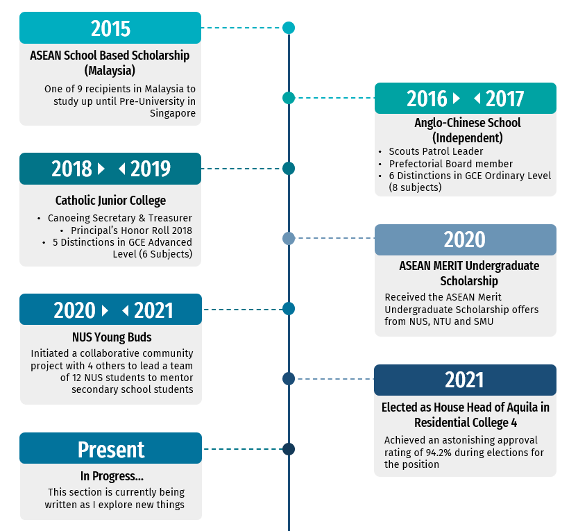

* I'm a __Computer Engineering__ Student at the __National University of Singapore__.
* I'm a proud resident of [__Residential College 4__](https://rc4.nus.edu.sg/), fostering Openness and Inclusion, 
Care and concern for all living and non-living things, Love for learning, Confidence in self and others, and Willingness
to pursue continuous improvement as a lifelong goal.
* I found myself to have an increasing interest in technology, particularly in the areas of __Software Engineering__, and would like to 
explore other areas such as __ML__, __Data Science__, and __Graphics__.
* Academics aside, I joined a multitude of co-curricular activities in NUS. I was a [__Marketing Executive__](https://www.instagram.com/p/CQqi11tMbJd/) at [__NUS Students' Union Student Life Fair__](https://nus.edu.sg/osa/orientation/events/student-life-fair)
and also initiated a community service project [__Young Buds NUS__](https://www.instagram.com/youngbuds.nus/) alongside my friends.
I was the [__House Head__](https://rc4.nus.edu.sg/house-committee/) of one of the 5 houses in Residential College 4 in Academic Year 21/22,
and participated in Spikeball, Frisbee and Volleyball interest groups in the residential college. I was also an active member 
of [__NUS Funkstyles__](https://www.nuscac.net/sub-clubs/funkstyles/). I will be embarking on a Student Exchange Program (SEP) in the upcoming semester from Janurary to early June of 2023. I particularly enjoy fictional stories and am a big fan of Doctor Strange.

---

Milestones
======

