# Github

# FPGA Design Project: Sight and Sound Entertainment System

## User Guide

|Feature|Input Devices|Feature Description|Images/Photos|
|---|---|---|---|
|Real-time audio volume indicator|SW0,  SW1|__SW0 IS 0:__ mic_in shown on 12 LEDs   __SW0 is 1:__ Peak intensity shown on 15 LEDs (0 level does not show anything)   __SW1  is 0:__ sound level in didgit shown on the anode   __ SW1 is 1:__ sound level in letter is shown on the anode (5 level for each level, 0 level is still 0|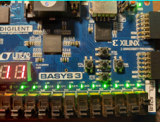 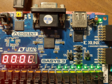|
|Totoro bus stop |Mic|4 levels of rain according to mic input:   __level 0:__ no rain   __level 1 - 5:__ slightly animated raining, slow rain falling speed   __level 6-10:__ moderate animated raining, moderate rain falling speed   __level 11 - 15:__ heavy animated raining, fast rain falling speed|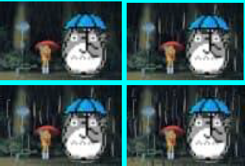|
|Menu|SW8, btnU, btnD, btnC|__SW8 is 0:__ shown the individual tasks __SW8 is 1:__ shown the menu __btnU:__ move selection up by 1 __btnD:__ move selection down by 1 __btnC:__ go into the mode of choice|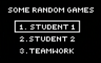 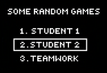 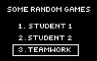 |
|Graphical Visualisations and configurations|SW15,  SW14, SW13, SW12, SW11, btnL, btnR, Mic|__SW15,SW14:__ 3 pixel thick border if 2’b10,1 pixel thick border if 2’b01 __SW13:__ Force Border off __SW12 is 1:__ Switches on alternate colour scheme __SW12 is 0:__ Switches off alternate colour __SW11 is 1:__ Switches off/hide volume bar while keeping the borders and background colour the same according to the other switches __Mic:__ There is a volume bar with the samenumber of level as the volume level. __btnL:__ Volume bar shifts left by 1 pixel __btnR:__ Volume bar shifts right by 1 pixel|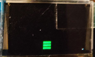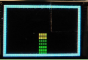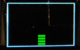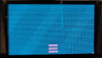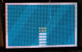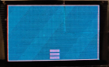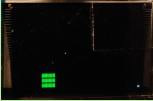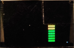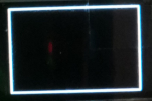|
|Run Barry Run!!|Mic|__Level 0:__ Lowest frame rate __Level 1-5:__ Slow frame rate shows slow run __Level 6-10:__ Faster frame rate for faster running __Level 11-15:__ Even Faster frame with 15 being the highest and the fastest run.|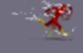|
|Volume level indicator in "Run Barry Run!!"|Mic|Horizontal Volume bar to allow visibility of Barry and indicates the current volume level input to user|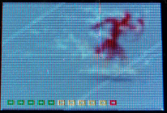|
|Ghost|btnU,   btnD,  btnL,  btnR|__btnU:__ Ghost moves up __btnD:__ Ghost moves down __btnL:__ Ghost moves left and start rotating leftwards __btnR:__ Ghost moves right and start rotating rightwards|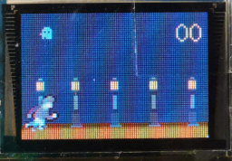|
|Man| |Man spawn to the left of the screen. Animated to run rightward When the ghost is __above__ and __behind__ him, and the __wave touches his ear__, man turns into a tombstone. When the man runs off the screen, the screen turns into the gameover screen.|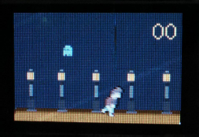|
|Wave|Mic|__Level X:__ Sound wave emitted from ghost with radius X| 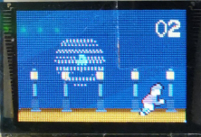|
|Tombstone| |Tombstone spawn and __stays still__ for around __2 - 3 seconds__ before despawning and Man starts running from the left of screen rightwards.|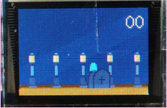|
|Score| |On the __upper right corner__ of the screen, whenever the man respawns from the grave, a point is added.| |
|Game over Screen| |Gameover screen with the total score displayed when the man __runs off__ the screen or the score is __99__.|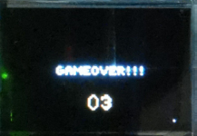 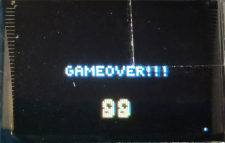|
|reset|SW7, SW9|__SW7 is 1:__ Game score Resets to 00, returns to __Main Menu__. (Blocks entry into games) __SW7 is 0:__ Allow selection of the Games __SW9 is 1:__ Resets score to __00__. Position of Man will hover at spawn point at the __bottom left__, Position of Ghost hovers at __top left__ __SW9 is 0:__ Game __starts__, Man starts moving right, ghost is able to move according to button press.| |
